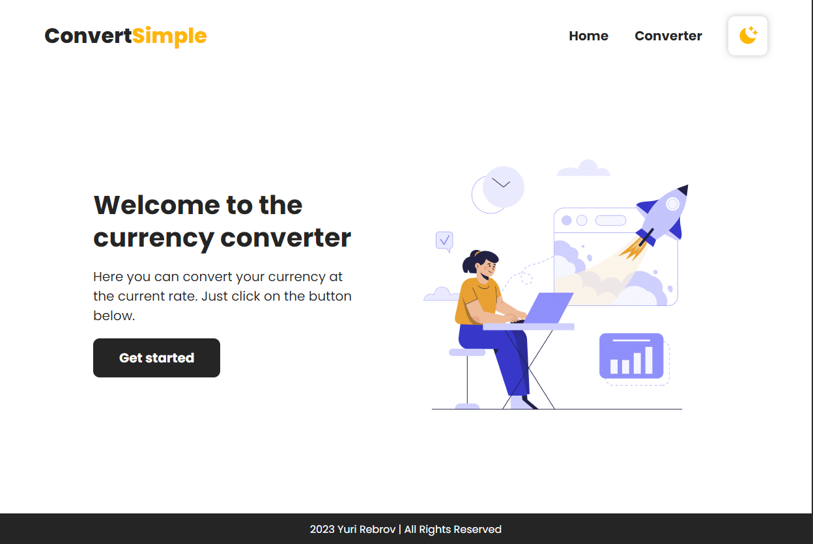
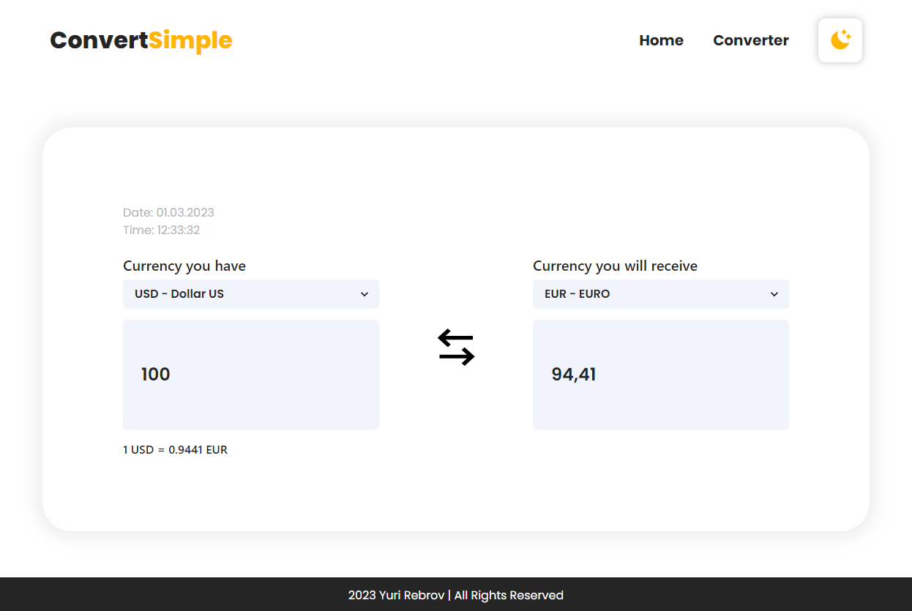

# Welcome to the Currency Converter App!

# Main page

# Converter page

# This project has the following features:
 - You can convert from one currency to another;
 - You can see exchanges rate for select currency;
 - Supports light/dark themes.
 
## Stack
 - [Vite+React](https://vitejs.dev/) - Vite is a build tool that aims to provide a faster and leaner development experience for modern web projects
 - [Tailwindcss](https://tailwindcss.com/) - Tailwind CSS is an open source CSS framework
 - [ChakraUI](https://chakra-ui.com/) - Chakra UI is a simple, modular and accessible component library that gives you the building blocks you need to build your React applications
